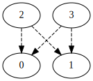

# Explicit Epistemic Model Checking for Dynamic Gossip

Related references:

- Hans van Ditmarsch, Jan van Eijck, Pere Pardo, Rahim Ramezanian, François Schwarzentruber:
  *Dynamic Gossip*.
  To appear in the Bulletin of the Iranian Mathematical Society (BIMS). 2015, last revised 2018-02-12.
  [arXiv:1511.00867](https://arxiv.org/abs/1511.00867)

- Hans van Ditmarsch, Jan van Eijck, Pere Pardo, Rahim Ramezanian, François Schwarzentruber:
  *Epistemic protocols for dynamic gossip*.
  In: Journal of Applied Logic, Volume 20, 2017, Pages 1-31,
  https://doi.org/10.1016/j.jal.2016.12.001

- Chapter 6 "Dynamic Gossip"
  in Malvin Gattinger: *New Directions in Model Checking Dynamic Epistemic Logic*,
  PhD thesis at ILLC, University of Amsterdam, 2018.
  https://malv.in/phdthesis

## Installation

You should have the [Haskell Tool Stack](https://haskellstack.org) installed.

    git clone https://github.com/m4lvin/gossip.git
    cd gossip
    stack build
    stack ghci

## Usage Examples

List all call sequences permitted by the protocol `lns` on the graph `threeExample` defined in the module `Gossip.Examples`:

    λ> mapM_ print $ sequences lns (threeExample,[])
    [(0,1),(0,2),(1,2)]
    [(0,1),(1,2),(0,2)]
    [(0,1),(2,1),(0,2)]
    [(1,2),(0,1)]
    [(2,1),(0,1)]

Count how many of these call sequences are successful and unsuccessful:

    λ> statistics lns (threeExample,[])
    (3,2)

The same, for another gossip graph given in short notation:

    λ> statistics lns (parseGraph "01-12-231-3 I4",[])
    (57,20)

Evaluate a formula at a gossip state:

    λ> eval (threeExample,[(0,1)]) (S 1 0)
    True
    λ> eval (threeExample,[(0,1)]) (S 1 2)
    False
    λ> eval (threeExample,[(0,1)]) (K 2 anyCall (S 1 0))
    True
    λ> eval (threeExample,[(0,1)]) (K 2 lns (S 1 0))
    True
    λ> eval (threeExample,[(0,1),(1,2)]) (S 0 2)
    False
    λ> eval (threeExample,[(0,1),(1,2)]) (S 2 0)
    True

If you have graphviz installed, you can visualize gossip graphs like this:

    λ> dispDot $ diamondExample

## Tests

The file `test/results.hs` contains a test suite that also covers most examples.
You can run it with `stack clean; stack test --coverage`.
